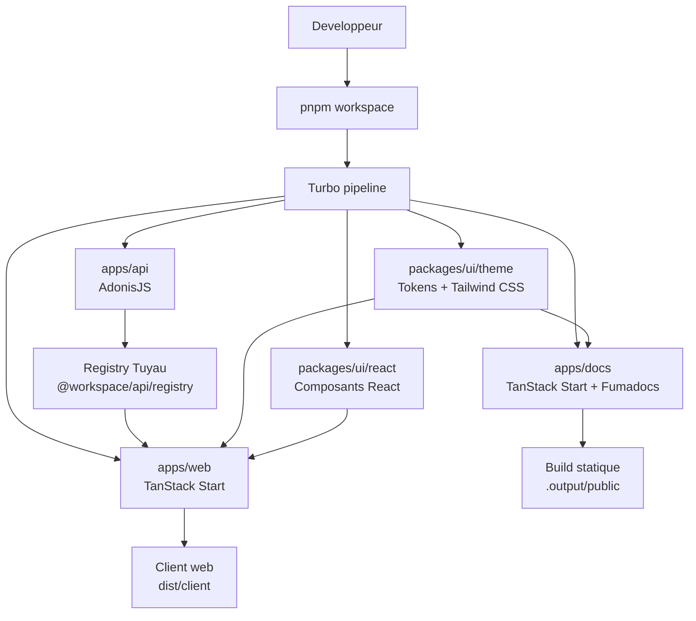

## Monorepo

E5 est un monorepo TypeScript gere par pnpm et Turbo.

```text
apps/
  api/   API AdonisJS
  web/   Application TanStack Start principale
  docs/  Documentation publique
packages/
  ui/react/   Composants React partages
  ui/theme/   Tokens et CSS Tailwind generes
```

## Vue d'ensemble



La documentation est volontairement separee de l'API pour cette premiere version :
elle peut etre build puis servie comme site statique, sans serveur Node ni appels API.

## API

`apps/api` porte le backend AdonisJS. Les routes sont organisees par features et les imports utilisent les alias du package.

## Web

`apps/web` porte l'application principale TanStack Start. Elle consomme l'API via Tuyau et utilise les packages UI du workspace.

## Documentation

`apps/docs` est une application TanStack Start separee, construite avec Fumadocs. Elle reste publique, statique et decouplee de l'API.

```bash
# Developpement local de la documentation
pnpm --filter @workspace/docs dev

# Validation TypeScript + generation Fumadocs
pnpm --filter @workspace/docs typecheck

# Build statique prerender
pnpm --filter @workspace/docs build
```

## UI

`packages/ui-theme` fournit les tokens Tailwind partages. La documentation importe ce theme pour rester coherente avec l'application principale.

## Regles de dependance

| Source | Peut dependre de | Pourquoi |
| --- | --- | --- |
| `apps/api` | Aucun package front | L'API reste autonome et expose ses contrats via Tuyau. |
| `apps/web` | `apps/api`, `packages/ui/*` | L'application principale consomme l'API et le design system. |
| `apps/docs` | `packages/ui/theme` | La documentation reprend le theme sans dependre de l'API. |
| `packages/ui/react` | `packages/ui/theme` | Les composants React suivent les tokens partages. |
| `packages/ui/theme` | Rien dans `apps/*` | Le theme reste reutilisable par toutes les applications. |
